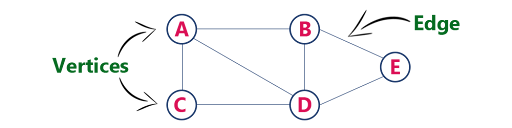
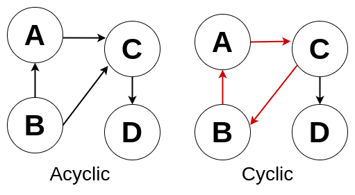
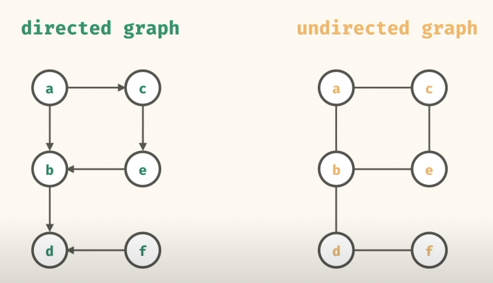

```json
{
  "A": ["B", "C", "D"],
  "B": ["A", "D", "E"],
  "C": ["A", "D"],
  "D": ["A", "B", "C", "E"],
  "E": ["B", "D"]
}
```

```java
private HashMap<String, ist<String>> adjList = new HashMap<>();

public boolean addVertex(String vertex) {
    if (adjList.get(vertex) == null) {
        adjList.put(vertex, new ArrayList<String>());
        return true;
    }
    return false;
}
// {                                        {
//      "A": [],   addEdge("A", "B") -->        "A": ["B"],
//      "B": []                                 "B": ["A"]
// }                                         }
public boolean addEdge(String vertex1, String vertex2) {
    if (adjList.get(vertex1) != null && adjList.get(vertex2) != null) {
        adjList.get(vertex1).add(vertex2);
        adjList.get(vertex2).add(vertex1);
        return true;
    }
    return false;
}
// {                                            {
//      "A": ["B"],   removeEdge("A", "B") -->        "A": [],
//      "B": ["A"]                                    "B": []
// }                                            }
public boolean removeEdge(String vertex1, String vertex2) {
    if (adjList.get(vertex1) != null && adjList.get(vertex2) != null) {
        adjList.get(vertex1).remove(vertex2);
        adjList.get(vertex2).remove(vertex1);
        return true;
    }
    return false;
}
// {                                                        {
//        "A": ["B", "C", "D"],                                 "A": ["B", "C"],
//        "B": ["A", "D"],          removeVertex("D") -->       "B": ["A"],
//        "C": ["A", "D"],                                      "C": ["A"]
//        "D": ["A", "B", "C"],                              }
// }
public boolean removeVertex(String vertex) {
    if (adjList.get(vertex) == null) return false;

    for(String other : adjList.get(vertex)) {
        adjList.get(other).remove(vertex);
    }
    adjList.reove(vertex);// ?
    return true;
}

```


